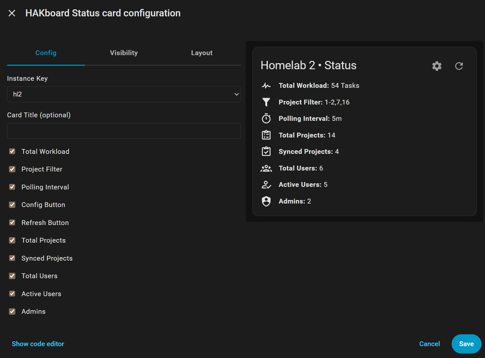

# HAKboard

📫 **Contact:** hakboard.dev@gmail.com  
🌐 **Language:** [🇺🇸 English](README.md) | [🇪🇸 Español](README.es.md)

## Introduction
HAKboard integrates project, task and user data from [Kanboard](https://kanboard.org/), a free and open source Kanban project management tool, into [Home Assistant](https://www.home-assistant.io/), an open source home automation platform. It stores project data in a collection of dynamically generated sensor entities for easy integration into automations and dashboards. It is installed and configured exclusively via the [Home Assistant Community Store (HACS)](https://www.hacs.xyz/) UI as a custom integration.

**Background**: The purpose of initially developing HAKboard was to explore what a zero-code Home Assistant custom integration could look like and hopefully make it easy for non-technical users. This necessitated a focus on:
- **User experience:** HAKboard must be easy to install and 100% UI-configurable from day 1.
- **Documentation:** Users should not have to look at code to understand how an integration works, and a data schemas must be included.
- **Compliance:** We implemented the latest, HA-approved methods to create and manage entities, perform API calls, construct the UI and generate native Lovelace cards.
- **Speed:** HAKboard is **fast**. Implementation of HA best practices for installation, re-configuration, network calls and entity management.

## Features
- Fully UI-driven configuration (no YAML or code required), installable via HACS.
- Includes three pre-built Lovelace cards: **System Status**, **Users**, and **Projects**. (see [Screenshots](#screenshots)).
- Connects to Kanboard using the official JSON-RPC API (webhook support planned).
- Adjustable polling interval (minimum 5 seconds) for near-real-time updates - use responsibly.
- Project filters let you sync only the projects you want to appear in HA.
- Supports multiple concurrent instances of the integration. This enables [blue/green deployment](https://en.wikipedia.org/wiki/Blue%E2%80%93green_deployment).  
- Connection Profiles allow different sync rules for the same Kanboard server  
  *(e.g., projects 1,3–5,7 refresh every 10s while project 23 refreshes every 24h).*
- Automatic entity creation with collision detection and orphan cleanup.
- Optimized for network performance using Home Assistant’s [DataUpdateCoordinator](https://developers.home-assistant.io/docs/integration_fetching_data/)
- Localization included: 🇺🇸 English, 🇪🇸 Español.

## Functionality
In this initial release, it is a one-way sync of Kanboard data into HA, with deep-linking to Kanboard projects from the HA dashboard. It will create an entity for every project that provides aggregate data for tasks, task status, assignees, columns etc.. giving you an excellent birds eye view of your environment, as well as the ability to create automations from the sensor data.

A very near release (see [Roadmap](#roadmap)) will introduce the creation of entities for each task and person, and likely others. We wanted to ensure the core entity generation system is rock-solid before opening it up to potentially thousands of new entities and thought it prudent to stagger this functionality.

## Why integrate a project management system with Home Assistant?
HAKboard enables Kanboard to become an active participant in your smart home. This unlocks some obvious use cases, such as triggering events when software-related milestones are achieved or critical bugs are updated. While this alone opens up some interesting possibilities, it becomes truly powerful when applied creatively. Other ideas include:
* Replace to-do/grocery apps that are increasingly bumping basic features to paid tiers.
* Compile household newsletters, updates, or even your smart home environment release notes directly from Tasks, then send a push notification only to members that have subscribed to, or are members of a particular project/group.
* Automatically add items to dynamic lists/projects based on home data. For example, when the filter or battery in that bothersome device needs replacing, automatically add it to a shopping list and/or automated online cart, including the make/model/accessory information, create a task in the 'Home Maintenance' project called 'Install New Filters', assign it to the owner of the device or project, set it to Ready when the filter arrives, notify the owner via push message, then finally set it to complete when the new sensor is installed and online with updated readings.
* Share a Home Assistant dashboard for chore tracking (where chores are Kanboard Tasks) that incorporate real-time device sensors (like a washer or dryer) alongside the chore.

While some of these examples are elongated and over-managed, it serves to illustrate the possibilities of a tightly-coupled project management system with Home Assistant.

## Interesting, but why Kanboard?
It's tiny, free, fast (both client and server-side), highly customizable, supports branding and themes (including mobile responsive themes), plugins, has an active community, a well maintained [repo](https://github.com/kanboard/kanboard) and an official [Docker image](https://hub.docker.com/r/kanboard/kanboard). The Docker image does not require a separate database as it ships with SQLite. It has sensible defaults and pre-configured board layouts so it's running in minutes, not hours or painful weekends.

**Notes**
* You need access to an existing Kanboard installation, HAKboard does not install Kanboard for you.
* HAKboard is not affiliated with Kanboard, we just think it's neat. 💖

## Screenshots
 
*Dashboard overview showing status, users, and projects. The HAKboard Status card includes controls to refresh the integration or jump to the re-configuration screen straight from the Dashboard to save you a few (thousand) clicks. Clicking on a user will bring up their HA entity history card and show their active task history. Clicking on a project will open that project directly in Kanboard.*  

 
*Status card editor with customization options. *Every* element on the card can be configured.*  

 
*Setup / re-configuration screen.*  

## I'm sold! How do I get started?

⚠️ **IMPORTANT INSTALL NOTES:** HAKboard is currently going through the official HACS approval process. In the meantime, please follow these instructions if you would like to install HAKboard (existing Kanboard server required):
- HA > HACS > ⚙️ (Top right) > Custom Repositories > Add: https://github.com/aktive/hakboard as type Integration
- Configure your Kanboard instance via Settings (Bottom left) > Devices & services > Add (Bottom right) > Search for HAKboard
- **NOTE:** If HAKboard does not appear (either as an integration or a dashboard card), please refresh your browser or restart HA.

Please read the [Documentation](#documentation) section below so you know what to expect post-installation.

### Manual installation
### Installing via HACS (Recommended)
HACS installations offer upgrade notifications, one-click upgrades and rollback support.
1. Login to HA and open HACS
2. Search the community store for `HAKboard` and select it
3. Review the notes and click the `Download` button to start the guided installation

### Manual installation
Manual installation is not recommended unless you plan to manually keep on top of updates.
1. Download the repo contents
2. Extract to your HA `config/custom_components/HAKboard` directory
3. Restart HA
4. Navigate to `Settings / Devices & services / + Add Integration` and search for HAKboard.

## Documentation:
### Installation
During installation, you must specify a Kanban Endpoint (your Kanboard server). At this time, you must also specify a unique `Instance Key`. This fictional identifier is prefixed to all created entity IDs to ensure uniqueness and make them human-readable. You can enter any name you like, but it's recommended to pick a succinct name you can rapidly identify as it will appear on all HAKboard created entity IDs. Further, you must specify a project filter to govern which projects will be synced from Kanboard to HA. Kanboard's Project ID is also added to the entity IDs for uniqueness.

### Re-configuration
To re-configure an existing integration, visit the `Settings / Devices & services / HAKboard` screen and click the `⚙️` icon on the integration. Or, simply click the `⚙️` icon directly from the HAKBoard Status Card via the dashboard! Re-configuration enables you to change the Instance Name, Endpoint URL, API Token, Project Filter and Polling Interval. You can **not** change the `Instance Key` as this is used as a part of the key for unique entity generation. If you need to change the `Instance Key`, remove the integration and re-add it with a new value. No data will be lost if you remove and re-create an integration.

### Integration and Entities
HAKboard will automatically generate a collection of HA sensor entities to store Kanboard data. Sensors are used because they're a well-supported entity type in HA, can receive real-time updates, store history, and are powerful dashboard allies.

If you configure your `Homelab 2` instance with an `Instance Key` of `hl2`, HAKboard will use the following naming schema for the newly created entities:
`sensor.hakboard_{instance_key}_xxx  `
For example: `sensor.hakboard_hl2_system_status`

### System Entities
System entities provide high-level statistics about your integration.  

**Entity ID:** *sensor.hakboard_hl2_system_status*: 10 (number of open tasks across all projects)  
**Name:** *Homelab2 • System Status*
- Attribute: api_endpoint: https://kanboard.homelab2.net/jsonrpc.php
- Attribute: config_entry_id: 01KB959BNGD9PEV0GZAAZM9WTS
- Attribute: display_name: Homelab2
- Attribute: friendly_name: Homelab2 • System Status
- Attribute: icon: mdi:pulse
- Attribute: last_success_timestamp: 2025-11-29T17:49:11.182526-08:00
- Attribute: poll_interval: 5s
- Attribute: project_filter: 1-4
- Attribute: synced_project_count: 4
- Attribute: unit_of_measurement: tasks

### Summary Entities
Summary entities provide high-level statistics for projects and users.

**Entity ID:** *sensor.hakboard_hl2_summary_projects_total*: 10 (number of total projects in Kanboard)  
**Name:** *Homelab2 • Summary: Projects Total*

**Entity ID:** *sensor.hakboard_hl2_summary_projects_synced*: 6 (number of projects synced after applying project filters)  
**Name:** *Homelab2 • Summary: Projects Synced*

**Entity ID:** *sensor.hakboard_hl2_summary_users*: 4 (number of total users in Kanboard)  
**Name:** *Homelab2 • Summary: Users*
- Attribute: active_count: 4
- Attribute: admin_count: 2
- Attribute: user_list:
  - name: Admin
    role: app-admin
    open_tasks: 18
  - name: Chad
    role: app-manager
    open_tasks: 1
  - name: Dean
    role: app-admin
    open_tasks: 6
  - name: Megan
    role: app-user
    open_tasks: 4

### Project Entities
Project entities provide project statistics.

> ⚠️ **Caution:** A project entity will be created for *each* project included in the project filter scope.  
> If you sync **26,326** projects, HAKboard will create **26,326 project entities**.

**Entity ID:** *sensor.hakboard_hl2_project_1*: 4 (number of active tasks in this project)  
**Name:** *Homelab 2 • Project 1: Shopping List*
- Attribute: id: 1 (Kanboard `project_id`.)
- Attribute: name: Home Assistant (Kanboard `name`.)
- Attribute: identifier: HA (Kanboard `identifier`.)
- Attribute: description: The Fitswell Family's Shopping List (Kanboard `description`.)
- Attribute: project_url: https://kanboard.homelab2.net/board/1 (Kanboard `url`. Enables click-through to projects from the dashboard.)
- Attribute: owner: Richard (Derived from Kanboard `owner_id`.)
- Attribute: project_email: richard.fitswell@homelab2.net (Kanboard `email`.)
- Attribute: last_activity: 2025-11-28T10:24:02 (Kanboard `last_modified` which updates any time a task within a project has been modified.)
- Attribute: overdue_count: 1 (Derived from Kanboard `date_due`, `is_active` and `is_overdue`.)
- Attribute: Backlog: 12 (Count of tasks assigned to the "Backlog" column; column metadata retrieved via Kanboard `getColumns`, task assignments from Kanboard `project` API method. Note: an attribute will be created for each column configured in a project, though only two are listed here as examples.)
- Attribute: Open: 3 (Count of tasks assigned to the "Open" column; column metadata retrieved via Kanboard `getColumns`, task assignments from Kanboard `project` API method. Note: an attribute will be created for each column configured in a project, though only two are listed here as examples.)

Any integration that threatens to introduce potentially unlimited dynamically generated entities is scary. Nightmare scenarios include unintended bulk entity creation with possible overwrites, entity duplication, zombie entities that magically reappear after being deleted, or flaky entities that behave inconsistently, especially upon HA reboots. HAKboard was written carefully to ensure all created entities are in tight sync with their counterparts in Kanboard, and most importantly, well documented. This is further highlighted with some scenarios around the deletion and modification of entities and projects:

### Scenario 1: Entity deleted from Home Assistant
Home Assistant does not allow you to delete the dynamically generated entities via the UI as they are 'managed' by the HAKboard integration. However, in the case of entity deletion by unsupported or other means, entities will be re-created when the affected HAKboard integration is reloaded via `Settings › Integrations › HAKboard › {Instance Name} › ⋮ Menu › Reload` or when HA restarts. This is intended behavior. If entities are being re-created that you do not want, simply modify your integration(s) to exclude the unwanted projects from the project filter.

### Scenario 2: Project deleted from Kanboard
If a project is deleted from Kanboard, it is no longer 'seen' by HAKboard and all associated entities will be removed automatically upon the next integration reload/HA reboot. This was purposefully implemented to maintain state between HA and Kanboard, however if you'd like to change this default behavior we'd like to hear from you.

### Scenario 3: Project renamed in Kanboard
If a project is renamed in Kanboard, the project entity's friendly name (NOT the entity ID) in HA will be renamed the next time the integration is reloaded or when HA restarts. For example, Kanboard project 4 called 'Video Surveillance' is already synced via HAKboard, and therefore the following project entity will have been automatically created: `sensor.hakboard_hl2_project_4` with the name `Homelab 2 • Project 4: Video Surveillance`. If you rename this project in Kanboard to 'Cameras', the next time HA starts or the integration is reloaded, the entity ID will remain unchanged but the `name` attribute will be updated to `Homelab 2 • Project 4: Cameras`.

### Scenario 4: Entity renamed or deleted in Home Assistant
If an entity's unique ID or name are edited in HA, those changes will persist unless manually renamed back to their original name. To reset the name, simply delete the custom name from the entity edit screen and it will revert to the default name generated by HAKboard. To reset the entity ID, you must manually rename it back to its original state. Entities deleted from HA are retained in HA's entity registry (`.storage/core.entity_registry`). So if you delete the integration then re-add it specifying the same Kanboard server and endpoint ID, the renamed entities will still be renamed in the new integration. This is expected HA behavior.

### Scenario 5: Project filter scope change
Reducing or increasing an existing integration's project filter will cause HAKboard to apply those changes (and add/remove entities as required) as soon as the `Submit` button is clicked configuration screen. This was purposefully implemented to maintain state between HA and Kanboard, however if you'd like to change this default behavior we'd like to hear from you.

## Card Configuration
Three cards are included with HAKboard. See [Screenshots](#screenshots) to view them on the dashboard.

### HAKBoard Status Card (frontend/hakboard-status-card.js)
Displays useful information about your HAKboard integration. This is a bespoke Lovelace card specificaly developed for HAKboard and can be easily added to your dashboard via the UI.
- **USAGE:** From your dashboard, select the `+ Add Card` button and choose the `HAKboard Status` card. It has multi-endpoint support, enables the user to configure which elements are displayed, and includes `🔄️ Refresh` and `⚙️ Config` buttons that allow you to refresh your Kanboard data, or configure the integration directly from the dashboard! This is extremely useful during the initial configuration period, after which they can be hidden using the checkboxes.

### Users Card (lovelace_card_users.yaml)
Displays a list of all users and their total assigned tasks. It denotes Admins, Users and Project Managers using icons. Items on this card are clickable entities that will open the HA Entity view. This card automatically looks for any HAKboard user entities and adds them to the card. Please review `lovelace_card_users.yaml` for examples.
- **USAGE:** This card is built using standard Lovelace YAML, but you do not need to edit YAML files (phew). The easiest way is to paste the prebuilt card code directly into the dashboard editor. From your HA dashboard, select `+ Add Card`, choose any type of card then select `Show code editor` and paste the contents of `lovelace_card_users.yaml`. It will automatically detect all relevant `hakboard.` user entities and display them on the card.
- **NOTE:** This card is not (yet) a native lovelace card. This was an intentional design in the early release do demonstrate the power of dynamically generating a card's contents based on flexible criteria. The card has several dependencies listed at the top of the file.

### Projects Card (lovelace_card_projects.yaml)
Displays vital statistics for each project, including the total number of tasks, `#️⃣ Project ID`, `🕑 Last Activity`, `👤 Project Owner`, `⚠️ Overdue Tasks` and 📊 statistics on the number of open tasks for each column configured in the project. Each entry is a clickable link that will take you directly to the project in Kanboard.
- **USAGE:** This card is built using standard Lovelace YAML, but you do not need to edit YAML files (phew). The easiest way is to paste the prebuilt card code directly into the dashboard editor. From your HA dashboard, select `+ Add Card`, choose any type of card then select `Show code editor` and paste the contents of `lovelace_card_projects.yaml`. It will automatically detect all relevant `hakboard.` project entities and display them on the card.
- **NOTE:** This card is not (yet) a native lovelace card. This was an intentional design in the early release do demonstrate the power of dynamically generating a card's contents based on flexible criteria. The card has several dependencies listed at the top of the file.

The Users and Projects yaml cards use several excellent HACS addons developed by [@thomasloven](https://github.com/thomasloven).  
**Note:** These addons are purely for display purposes and do not alter your Home Assistant's core functionality.

---

## Roadmap:
* `Q4-25` Implement configurable SSL verification for Kanboard API (verify_ssl currently set to off for MVP launch)
* `Q1-26` Webhooks for real-time updates
* `Q4-25` Entities for each task
* `Q4-25` Kanboard Labels exposed as attributes
* `Q1-26` Create/update Kanboard tasks from HA/automations
* `Q1-26` Additional Lovelace template cards for advanced statistics and graphs
* `Q1-26` Aggregated reporting statistics to display useful context such as, *"How many high priority issues were closed this month that took >20% longer than average?"*. Or better yet, get creative with Home Assistant! *"How many issues were closed faster than average while I was at home, logged into my development PC vs my archaic laptop, while Hall and Oates was playing on Spotify, while my coffee machine has been refilled more than 3 times?"*

---

**License:** *MIT – free to use, fork, remix, pickle, whatever - just keep credit.*
